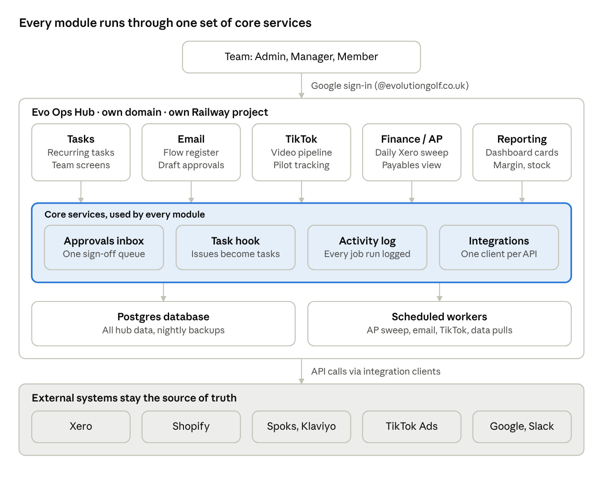

# Evo Ops Hub — Build Spec

Oct 8, 2026 · @Layton

## Purpose and scope

Evo Ops Hub is one web app, on its own domain, that brings every
Evolution Golf operational tool under a single login, database and
navigation. Evo Tasks is the foundation. Email automation, TikTok
management, the AP/finance hub and reporting plug in as modules.

The hub's job is to cut the time the team and Layton spend chasing work
across separate tools. It is not a new product. Every build decision is
judged against that, and against the Evo objective of recovering the
director loan.

**In scope:** Evolution Golf (GB Golf Online Ltd) only. Five modules:
Tasks, Email, TikTok, Finance/AP, Reporting. Four shared services:
approvals inbox, task creation, activity log, integrations.

**Out of scope:** Dogstar Digital, Par Box/Golf UK Services, Atlantic,
Market Overflow. The customer-facing members portal and Custom Club App.
A public API.

### Design principles

1.  **Separate and portable.** Own domain, own Railway project, own
    database, own credentials. Nothing shared with other businesses, so
    the hub can transfer with Evo in a sale or be shut down cleanly.

2.  **Humans approve, Claude drafts.** Anything that goes out to
    customers, spends money or writes to Xero lands in the approvals
    inbox first. Auto-execution is switched on per action type only
    after it has proven reliable.

3.  **Every problem becomes a task.** When a module needs a person, it
    creates a task in Evo Tasks for the right owner. No problem lives
    only in a log.

4.  **One place to see what ran.** Every automated job writes to the
    activity log, success or failure.

5.  **Simple for the team.** Team members see their tasks and their
    approvals. Admin complexity stays behind the admin role.

6.  **Lean.** Build the smallest version of each module that removes a
    manual step. Defer anything that doesn't.

## Current tools and what moves in

Five existing tools fold into the hub. Where each one runs today still
needs confirming before Phase 1. The "Today" column is the best current
understanding.

| Tool                 | Today                                                                                                                                   | Moves in as                                            | Keeps running where                                                                 |
|----------------------|-----------------------------------------------------------------------------------------------------------------------------------------|--------------------------------------------------------|-------------------------------------------------------------------------------------|
| Evo Tasks            | Build spec written for Claude Code (Aug 2026); replacing ClickUp                                                                        | Core shell and Tasks module                            | Inside the hub                                                                      |
| Email automation     | n8n Email Factory for Klaviyo; Spoks flow rebuild in progress via Claude Code                                                           | Email module                                           | Spoks/Klaviyo stay the sending platforms; the hub drafts, queues approvals and logs |
| TikTok management    | Claude Code tooling being built for TikTok ads selling members-only portal offers                                                       | TikTok module                                          | TikTok stays the ad platform; the hub manages the content pipeline and tracking     |
| AP / finance hub     | Spec for a daily finance-mailbox sweep into Xero via API, statements archived to Google Drive                                           | Finance/AP module                                      | Xero stays the ledger; the sweep becomes a hub worker                               |
| Reporting            | Internal dashboard (Overview, Trading, Admin; ~18 cards); Margin, Dead Stock and Incoming Stock have no data; Harry's Ads layer planned | Reporting module, rebuilt on hub data                  | Inside the hub                                                                      |
| SEO content workflow | n8n "SEO Content Creation" (being rebuilt)                                                                                              | Not a module in v1; posts its runs to the activity log | n8n                                                                                 |

### To confirm before Phase 1

- [ ] Where each tool's code lives today (repo, Claude Code project,
  n8n, Cowork, artifact)

- [ ] Whether Evo Tasks is already built and deployed, or still at spec
  stage

- [ ] Email platform decision: Spoks, Klaviyo, or both during the
  switchover

- [ ] Which Gmail account receives finance@evolutiongolf.co.uk and how
  the hub authenticates to it

- [ ] The domain for the hub (for example ops.evogolf.app or a new
  standalone domain)

- [ ] Team list and who holds the admin role

## Architecture and hosting

The hub is one Next.js app and one Postgres database in its own Railway
project, on its own domain. Modules never talk to external systems
directly; they go through the core services, which call Xero, Shopify,
Spoks/Klaviyo, TikTok and Google.

Evo Ops Hub architecture · 5 modules, 4 core services

External platforms stay the source of truth. The hub drafts, queues,
approves, logs and reports, but customer data, the ledger and email
sending stay where they are today.

| Item         | Choice                                              | Why                                                                              |
|--------------|-----------------------------------------------------|----------------------------------------------------------------------------------|
| Hosting      | Railway, single project, EU region                  | Already connected; app, database and workers in one place                        |
| Domain       | Hub's own domain, separate from evolutiongolf.co.uk | Keeps internal tooling apart from the customer site; transfers cleanly in a sale |
| App          | Next.js (TypeScript), Tailwind                      | One codebase for screens and API routes                                          |
| Database     | Postgres (Railway), Prisma                          | One schema for all modules                                                       |
| Jobs         | pg-boss on the same Postgres                        | Scheduled workers without extra infrastructure                                   |
| AI           | Claude API via Evo's own API key                    | Drafting, extraction and summaries inside workers                                |
| Environments | Staging and production                              | Test against sandbox/draft modes before going live                               |

## Auth, users and roles

One login for the whole hub, with three roles. Sign-in is "Sign in with
Google" restricted to the @evolutiongolf.co.uk Google Workspace domain,
so leavers lose access when their Google account is closed. An email
magic link is the fallback for anyone without a Workspace account.

| Role    | Who                              | Can see                                            | Can do                                                                                                            |
|---------|----------------------------------|----------------------------------------------------|-------------------------------------------------------------------------------------------------------------------|
| Admin   | Layton, Luke                     | Everything, including Finance and Admin reporting  | Manage users and roles, set recurring tasks, approve any item, change integration settings and automation toggles |
| Manager | Karin, Katy (finance only)       | Their team's tasks, module screens they're granted | Set tasks for others, approve items in their granted modules                                                      |
| Member  | Alex, Brad, Jack and other staff | Their own tasks and approvals assigned to them     | Tick off tasks, comment, approve or reject items assigned to them                                                 |

Module access is granted per user on top of the role. For example, Katy
is a Manager with Finance access only, and Harry could be added as a
Member with Reporting access only.

Requirements:

- Sessions expire after 12 hours of inactivity; admins can force
  sign-out.

- Every approval, rejection and settings change is recorded with user
  and timestamp.

- No shared logins. API keys for Xero, Shopify, Spoks, Klaviyo, TikTok
  and Google live only in Railway environment variables, never in the
  database or the browser.

### Access to external systems and data protection

Each integration requests only the API scopes its module needs. This
limits the damage from a bug or a leaked key.

| System                  | Scope for v1                                                                         | Never                                             |
|-------------------------|--------------------------------------------------------------------------------------|---------------------------------------------------|
| Xero                    | Read accounts, contacts, transactions; create draft bills; attach files              | Authorise, pay or delete bills; change settings   |
| Shopify                 | Read orders, products, inventory, discounts; create discount codes for TikTok offers | Edit products, prices or customers                |
| Spoks / Klaviyo         | Read flows, campaigns and metrics; create drafts; publish only after approval        | Delete flows or lists; export full customer lists |
| TikTok Ads              | Read campaign performance                                                            | Change budgets or bids                            |
| Gmail (finance mailbox) | Read messages and attachments; apply labels                                          | Send, delete or forward                           |
| Google Drive            | Write to the hub's archive folder only                                               | Access other folders                              |

GDPR basics:

- The hub stores staff names and emails, supplier invoice data, and
  customer data only where needed for a task or approval (for example an
  order number). It never bulk-copies customer lists.

- Invoice PDFs are archived to Drive, not stored in the hub database.

- A short data note in the repo lists what personal data each module
  holds, why, and how long it's kept. Default retention: 12 months for
  logs, 24 months for approvals history.

- Leavers are deactivated, not deleted, so their history stays
  attributable.

## Shared data model and core services

Four core services sit under every module: approvals, tasks, the
activity log and integrations. Modules must use them rather than
building their own versions. This is what makes the hub one system
instead of five apps behind one menu.

### Core tables

All tables have id (UUID), created_at, updated_at. Module-specific
tables are prefixed with the module name (email\_, tiktok\_, ap\_,
report\_).

| Table               | Purpose                                    | Key fields                                                                                                                                          |
|---------------------|--------------------------------------------|-----------------------------------------------------------------------------------------------------------------------------------------------------|
| users               | Hub users                                  | email, name, role (admin/manager/member), module_access\[\], active                                                                                 |
| tasks               | One-off and generated task instances       | title, description, assignee_id, due_date, status (open/done/skipped), source_module, source_ref, recurring_template_id, completed_at, completed_by |
| recurring_templates | Daily/weekly/monthly task definitions      | title, assignee_id, frequency, day_rules, active (per existing Evo Tasks spec)                                                                      |
| approvals           | Items waiting for a human decision         | module, item_type, title, summary, payload (JSON), preview_url, assignee_id, status, decided_by, decided_at, decision_note, expires_at              |
| activity_log        | Every automated run and significant action | module, job_name, run_id, status (success/warning/failed), message, details (JSON), started_at, finished_at                                         |
| integrations        | Connection health per external system      | name, status (ok/degraded/down), last_success_at, last_error                                                                                        |
| settings            | Automation toggles and thresholds          | key, value, updated_by                                                                                                                              |

### Approvals inbox

One queue for everything needing sign-off, filterable by module and
assignee. An approval moves through: pending, then approved, rejected or
expired. On approved, the owning module executes the action and logs the
result. On rejected, the decision note goes back to the module, and a
task is created if rework is needed.

Each approval card shows a plain-English summary, a preview (email
render, video, invoice PDF), and Approve / Reject / Edit-then-approve
buttons. Approvals older than 48 hours are flagged on the home screen.

### Task hook

Any module can call one internal function, createTask(title,
description, assignee, due, source_module, source_ref). The task links
back to the item that raised it. Examples:

- AP sweep finds an invoice with no matching supplier: task for Katy.

- Email flow draft needs copy sign-off: task for Alex.

- A worker job fails twice in a row: task for the admin.

Tasks from modules appear in the assignee's normal task list, marked
with the module badge.

### Activity log

Every background job writes a start and finish entry. Failures include
the error and enough detail to rerun. The log is searchable by module,
job and date, and keeps 12 months of history.

### Integrations and jobs

Each external system has one client wrapper in the codebase, used by
every module: Xero, Shopify, Spoks, Klaviyo, TikTok, Gmail, Google
Drive, Slack. Each wrapper updates the integrations table on every call,
so a broken connection shows on the home screen within one run.

Background jobs run as scheduled workers in the same Railway project,
using a Postgres-backed job queue (for example pg-boss), so there is no
extra infrastructure to run. Jobs must be idempotent: rerunning one must
not create duplicate bills, tasks or emails.

## Module specs

Each module is a section of the app with its own screens, tables and
workers. Each must use the core services above. v1 scope is the minimum
that removes a manual step; later items are listed but not built.

### 1. Tasks (Evo Tasks)

Built to the existing evo-tasks-build-spec.md, which stays the source of
truth for the recurrence engine, member screen and admin report. Changes
for the hub:

- Becomes the app shell: its auth, layout and user model are the hub's.

- tasks gains source_module and source_ref so other modules can raise
  tasks.

- The member screen shows module badges and links through to the source
  item.

- The rolling 30-day admin report counts module-raised tasks separately
  from recurring ones.

### 2. Email

The hub becomes the control panel; Spoks (or Klaviyo during switchover)
stays the sending platform.

v1:

- **Flow register:** every live and draft flow, with platform, trigger,
  status, owner and last-edited date, pulled from the platform API.

- **Draft approvals:** flows and campaigns created by Claude Code or the
  n8n Email Factory arrive as approvals with a rendered preview. Approve
  publishes or schedules via the API.

- **Performance snapshot:** revenue, open rate and click rate per flow
  and campaign, last 30 days, refreshed daily.

Later: segment health checks, simple-vs-complex flow A/B tracking.

### 3. TikTok

Supports TikTok as an ad channel driving members-only discounts bought
through the Evo members portal.

v1:

- **Content pipeline:** board of videos by stage: idea, scripted,
  filmed, edited, approved, live. Each video links to its product, the
  portal offer and the Shopify discount code.

- **Approval before upload:** finished videos arrive as approvals with
  the video preview, caption and offer details.

- **Pilot tracking:** daily pull of spend, views, clicks and CPA from
  TikTok Ads, joined to portal sign-ups and orders using the offer's
  discount code or UTM. Headline figure: cost per paid member and cost
  per order against the £28 CPA benchmark.

Later: automated video assembly, presenter scheduling.

### 4. Finance / AP

The existing finance-mailbox-to-Xero spec, run as a hub worker. Visible
to Admins and Katy only.

v1:

- **Daily sweep worker:** reads finance@evolutiongolf.co.uk, extracts
  invoices and credit notes, creates draft bills in Xero via API, and
  archives the PDFs and statements to Google Drive.

- **Exceptions as approvals:** unknown supplier, amount mismatch,
  possible duplicate, or a statement line with no matching Xero invoice.
  Each one becomes an approval or a task for Katy.

- **Payables view:** what's due this week, next week and later, with the
  Motocaddy monthly payment and its ≥£50k budget pinned at the top.

- **Unreconciled list:** bank transactions with no invoice or receipt
  attached, oldest first.

Rules: bills are created in Xero as drafts only, never authorised or
paid by the hub. No payment initiation of any kind.

Later: supplier statement reconciliation report (as done for
TaylorMade), loan-repayment schedule tracker.

### 5. Reporting

The existing dashboard rebuilt on hub data. Build last, once the other
modules are producing data.

v1:

- Port the existing ~18 report cards with RAG status, drill-downs and
  CSV export.

- Fill the three empty reports: Margin (Shopify sales against Xero cost
  of sales), Dead Stock (stock value by age band against the £45k
  target) and Incoming Stock (open purchase orders and prebooks).

- Ops cards from hub data: task completion rate, approvals waiting,
  failed jobs this week.

- Marketing view (Google Ads, TikTok, email) for whoever manages PPC,
  available as a Reporting-only login.

Later: loan recovery tracker against the Loan Recovery Plan schedule.

## Home screen and navigation

The home screen answers one question for each user: what needs me today?
It shows only what the user's role and module access allow.

**Member home**, top to bottom:

1.  My tasks due today and overdue, with tick-off in place.

2.  Approvals assigned to me.

3.  This week's upcoming tasks.

**Admin home** adds:

1.  A status strip: approvals waiting (with count over 48 hours), failed
    jobs in the last 24 hours, and any integration that is degraded or
    down.

2.  Team completion today and over the rolling 30 days.

3.  Three headline numbers: payables due this week, TikTok pilot cost
    per paid member, and email revenue over the last 7 days.

**Navigation:** a left-hand bar with Home, Tasks, Approvals, Email,
TikTok, Finance, Reporting, Activity and Admin. Modules a user can't
access are hidden, not greyed out.

**Mobile:** the member home, task tick-off and approvals must work on a
phone. Module screens can be desktop-first.

**Notifications:** a daily 07:30 digest (email or Slack, per user)
listing tasks due and approvals waiting. Immediate Slack alerts only for
failed jobs and integrations going down, sent to admins.

## Build phases and migration

Five phases, each shippable on its own. Each phase ends with a gate.
Don't start the next phase until the gate is met, so a stall in one
module never leaves the hub half-built.

1.  **Phase 1: Shell and Tasks.** Domain, Railway project, Postgres,
    Google sign-in, roles, Evo Tasks to its existing spec, home screen,
    activity log.

    - Migration: recreate the recurring tasks the team actually uses
      from ClickUp. Don't import ClickUp history.

    - Gate: the whole team has used it daily for 2 weeks, and ClickUp is
      no longer needed for recurring tasks.

2.  **Phase 2: Core services.** Approvals inbox, task hook, integrations
    table and health strip, daily digest, Slack alerts, plus the
    monitoring layer: job registry, Health page, uptime monitor, error
    tracking and deploy checks.

    - Gate: a test approval and a test module-raised task work end to
      end.

3.  **Phase 3: Finance/AP.** Port the AP sweep as a worker, plus
    exceptions, payables view and unreconciled list.

    - Migration: run in parallel with Katy's current process for 2
      weeks, compare outputs, then switch.

    - Gate: zero duplicate bills, and Katy signs off the exception list
      as accurate.

4.  **Phase 4: Email and TikTok.** Flow register, draft approvals and
    performance for Email. Content pipeline, approvals and pilot
    tracking for TikTok.

    - Migration: existing n8n and Claude Code jobs send their drafts to
      the hub's approvals instead of running unattended.

    - Gate: one full campaign and one TikTok video have gone through
      approval to live.

5.  **Phase 5: Reporting.** Port the dashboard, fill the three empty
    reports, add ops and marketing cards.

    - Gate: Layton uses the hub as his weekly Evo review instead of the
      old dashboard.

The Finance phase comes before Email and TikTok because it removes the
most manual work and touches the loan recovery figures directly. Swap
the order if the TikTok pilot needs tracking sooner.

**Measure before each phase.** Record how long the manual version takes
today, with the person who does it. Examples: hours per week Katy spends
on AP entry and statement checks, time spent chasing incomplete
recurring tasks, time spent assembling the weekly Evo numbers.
Re-measure 4 weeks after the phase goes live. A module that doesn't save
meaningful time gets simplified or switched off, not extended.

## Monitoring and health

The biggest risk isn't a job that crashes loudly. It's one that stops
running, or runs and quietly does nothing. So monitoring checks three
things for every tool: did it run, did it succeed, and did it produce
what we expected. The results show on one Health page and only alert a
person when action is needed.

### 1. Job registry: did it run?

Every worker is registered with its expected schedule and what a good
run looks like. A check every 15 minutes flags any job that has missed
its window.

| Job                       | Expected schedule | Good run looks like                                     | Warning if                                                     |
|---------------------------|-------------------|---------------------------------------------------------|----------------------------------------------------------------|
| AP sweep                  | Daily 06:00       | Emails read, bills drafted, PDFs archived; counts match | 0 emails on a weekday; bills drafted fewer than invoices found |
| Recurring task generation | Daily 00:30       | Today's tasks created for every active template         | Any active template produced no task                           |
| Email performance pull    | Daily 05:00       | Data returned for every live flow                       | A live flow with no data for 2 days                            |
| TikTok pilot pull         | Daily 05:30       | Spend and conversions returned                          | Spend shown but 0 tracked conversions for 3 days               |
| Reporting refresh         | Daily 06:30       | Every report card refreshed                             | A card older than 26 hours                                     |

New jobs must be added to this registry before they go live (see Adding
a new module).

### 2. Outcome checks: did it work as expected?

Each job ends with a self-check against its "good run" rule and writes
success, warning or failed to the activity log. Warnings mean it ran but
something looks off. Examples: a count mismatch, an empty result that
shouldn't be empty, or a figure outside its normal range compared with
the last 14 runs.

### 3. Integrations: are the connections alive?

- Each integration client records its last success, last error and token
  expiry date.

- Tokens expiring within 7 days raise a task for the admin.

- Rate-limit and auth errors mark the integration degraded or down on
  the status strip.

### 4. The app itself: is the hub up?

- A /api/health endpoint checks the app, the database and the job queue.

- An external uptime monitor (for example Better Stack or UptimeRobot)
  hits it every 5 minutes. This catches the case where the hub itself is
  down and can't alert anyone.

- An error tracker (for example Sentry) captures app crashes and screen
  errors with the user and page, so they're visible without anyone
  reporting them.

### Health page and alerts

An Admin-only Health page shows each module as green, amber or red, with
its last run, last success, open warnings and a "run now" button. The
admin home status strip summarises it.

Alert rules, designed to avoid noise:

| Event                     | Action                                                                             |
|---------------------------|------------------------------------------------------------------------------------|
| Hub down (uptime monitor) | Immediate Slack and email to admins                                                |
| Integration down          | Immediate Slack to admins                                                          |
| Job missed its window     | Slack to admins                                                                    |
| Job failed once           | Activity log only; retries automatically                                           |
| Job failed twice in a row | Slack plus a task for the admin                                                    |
| Outcome warning           | Listed in the daily digest; task for the module owner if it repeats 3 days running |

One alert per incident. No repeat alerts until it recovers, and a
"recovered" message when it does.

**Hub owner.** One named team member (proposed: Karin) owns day-to-day
health. They check the daily digest, triage warnings, rerun failed jobs
and raise tasks, escalating to Layton only for integration outages,
repeated failures or anything touching Xero. The hub owner gets Manager
role with Health page access.

### Fixing problems without an in-house developer

Every failed run and error has a "Copy for Claude Code" button. It
copies the job, error, recent log lines and the relevant spec section
into one block, ready to paste into Claude Code. Fixes go to staging
first, then production.

### Kill switches

Every module has an "Automation" toggle on the Admin screen, stored in
settings. Off means its workers stop taking external actions (no Xero
writes, no publishing, no uploads) while screens, data and the approvals
queue keep working. Switching off is instant, logged with who and why,
and shown as amber on the Health page until switched back on. There is
also one global switch that pauses all automations at once.

### Claude API cost controls

- Every Claude API call is logged with module, job, model, input tokens,
  output tokens and cost.

- Each module has a monthly budget in settings. At 80% the admin gets a
  Slack alert. At 100% the module's AI steps pause and raise a task, but
  non-AI work continues.

- Use the cheapest model that does the job reliably: smaller models for
  extraction, classification and summaries; larger models only for
  writing customer-facing copy.

- The Health page shows month-to-date AI spend per module against
  budget, and the weekly health summary flags any module trending over.

- Prompts are stored as versioned files in the repo, not inline in code,
  so a cost or quality change can be traced to a prompt change.

### Preventing breakage at deploy

- Automated tests for each module run before every deploy; a failing
  test blocks the deploy.

- Every change goes to staging first, then production.

- After each production deploy, a smoke test signs in, loads each module
  and runs each job in dry-run mode.

- A weekly Claude-written health summary for Layton covers uptime,
  failed and missed runs, recurring warnings, and anything trending
  worse.

## Adding a new module

A new function is added as a module that plugs into the core services,
without changing existing modules. Claude Code works through this
checklist for every new module and reports against it at the end.

- [ ] One-page brief: what manual step it removes, who uses it, and how
  it helps loan recovery or team time, with today's manual time measured
  as a baseline.

- [ ] Nav section and screens under its own route, hidden from users
  without access.

- [ ] Tables prefixed with the module name; changes only through
  migrations, never by editing other modules' tables.

- [ ] Customer-facing, spend or ledger actions go through the approvals
  inbox.

- [ ] Problems needing a person go through the task hook, with a named
  default owner.

- [ ] External calls go through an existing integration client, or a new
  one in /lib/integrations.

- [ ] Every worker is idempotent, writes to the activity log and has a
  "run now" button.

- [ ] Every worker is added to the job registry with its schedule,
  good-run rule and warning rule.

- [ ] Module tile added to the Health page, with an Automation kill
  switch, a monthly AI budget and minimum API scopes listed.

- [ ] Automated tests and a dry-run smoke test added to the deploy
  checks.

- [ ] Module access added to the user admin screen.

- [ ] Handover note updated with what the module does, its jobs and its
  keys.

Stays out of the hub: anything for Dogstar, Par Box or other businesses,
and customer-facing features. Those get a separate sibling app built
from the same template.

## Acceptance tests, requirements and Claude Code instructions

### Acceptance tests (whole hub)

- [ ] A user outside @evolutiongolf.co.uk cannot sign in.

- [ ] A Member cannot see Finance or Admin screens, even by typing the
  URL.

- [ ] A recurring daily task regenerates the next day and appears on the
  assignee's home.

- [ ] A module-raised task appears in the assignee's list with its
  module badge and links back to the source item.

- [ ] Approving an item triggers the module action exactly once;
  double-clicking approve does not run it twice.

- [ ] A rejected item records the note and creates a rework task when
  flagged.

- [ ] Rerunning the AP sweep for the same day creates no duplicate Xero
  bills.

- [ ] The hub never authorises or pays a bill in Xero.

- [ ] Revoking the Xero token shows Xero as down on the admin status
  strip within one run, and sends a Slack alert.

- [ ] Every worker run appears in the activity log with status and
  duration.

- [ ] Member home, task tick-off and approvals work on a phone-sized
  screen.

### Non-functional requirements

- **Hosting:** Railway, one project for the hub only, London/EU region.
  Separate staging environment.

- **Domain:** hub's own domain with HTTPS. Not a subdomain of
  evolutiongolf.co.uk, so it stays separate from the customer site.

- **Data:** nightly Postgres backups kept for 30 days. Customer personal
  data stays in Shopify/Spoks and is only referenced, never copied in
  bulk.

- **Cost ceiling:** target under £60/month for hosting and database at
  v1 volumes, excluding Claude API usage.

- **Portability:** a written handover note in the repo covering how to
  run, deploy, rotate keys and transfer ownership.

### Instructions for Claude Code

- Build one phase at a time and stop at each gate for Layton's review.
  Don't start the next phase unprompted.

- Treat this spec plus evo-tasks-build-spec.md as the source of truth.
  If they conflict, ask.

- Suggested stack: Next.js (TypeScript) app with server actions,
  Postgres with Prisma, pg-boss for jobs, Auth.js with Google provider,
  Tailwind. Propose an alternative only with a concrete reason.

- One integration client per external system in /lib/integrations, used
  by all modules.

- Every worker writes to activity_log, is idempotent, and has a manual
  "run now" button for admins.

- Ask before any action that writes to a live external system (Xero,
  Shopify, Spoks, Klaviyo, TikTok) during development. Use sandbox or
  draft modes wherever they exist.

- At the end of each phase, report what was built, what was deferred,
  and the result of each relevant acceptance test.
